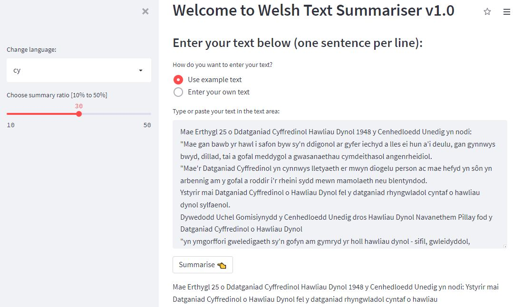

# Welsh Summarisation Dataset
This repo holds the Welsh Summarisation Dataset and Python demo scripts and notebooks. It is being actively updated at the moment, so keep watching the space.

### Dataset

### Usage

### Demo
Here is the link to [a simple demo](https://share.streamlit.io/ignatiusezeani/welsh-text-summarizer/main/streamlit/app.py) of the Welsh Text Summarisation tool.

### Paper(s):
- **Introducing the Welsh Summarisation Dataset and Baseline Systems** (Details soon...)

### Contacts
- [Ignatius Ezeani](https://github.com/IgnatiusEzeani)
- [Mahmoud El-Haj]()
- [Jon Morris]()
- [Dawn Knight](https://github.com/DawnKnight-Cardiff)

 This work is licensed under a <a rel="license" href="http://creativecommons.org/licenses/by/4.0/">Creative Commons Attribution 4.0 International License</a>.
